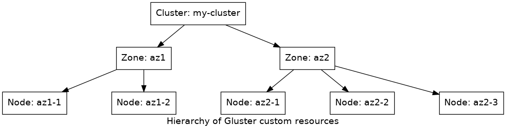

This document describes the set of [Custom Resource Definitions
(CRDs)](https://kubernetes.io/docs/concepts/extend-kubernetes/api-extension/custom-resources/)
that will be used to configure a GCS Gluster cluster. The actual implementation
of the resources described here will be phased in during development. The
purpose of this document is to provide the overall structure, ensuring the end
result provides necessary configurability in a user-friendly manner.

# Overview

A single Gluster operator may control one or more individual Gluster clusters.
Each cluster could be either hosted within the Kubernetes cluster as a set of
pods (a converged configuration) or the Gluster nodes could be running on hosts
outside the Kubernetes cluster (referred to as independent mode). The
capabilities of the operator differ significantly between these two modes of
deployment, but the same set of CRDs should be used for both where possible.

A given Gluster cluster is defined by several different Custom Resources (CRs)
that form a hierarchy. At the top level is the "cluster" CR that describes
cluster-wide configuration options such as the "name" for the cluster, the TLS
credentials that will be used for securing communication, and peer clusters for
geo-replication.

Below the cluster level are zone definitions. These describe the different
failure domains that the Gluster servers are spread across. This definition
describes how pods in the zone should be created (for converged deployments) or
where (DNS name) to find existing nodes (for independent mode).

Below the zone definitions are individual node definitions that track the state
of the individual Gluster pods. Manipulating these objects permits an
administrator to place a node into a "quiesced" state for maintenance or
decommission it entirely.



# Custom resources

This section describes the fields in each of the custom resources.

## Cluster CR

The cluster CR defines the cluster-level configuration. A commented example is
shown below:

```yaml
apiVersion: "operator.gluster.org/v1alpha1"
kind: Cluster
metadata:
  # Name for the Gluster cluster that will be created by the operator
  name: my-cluster
  # CRD is namespaced
  namespace: gcs
spec:
  # Cluster options allows setting "gluster vol set" options that are
  # cluster-wide (i.e. don't take a volname argument).
  clusterOptions:  # (optional)
    "cluster.halo-enabled": "yes"
  # Gluster CA to use for generating Gluster TLS keys.
  # Contains Secret w/ CA key & cert
  glusterCA: ca-secret
  # Georeplication
  replication:  # (optional)
    # Credentials for using this cluster as a target
    credentials: secretRef
    targets:
      # Each target has a name that can be used in the StorageClass
      - name: foo
        # Addresses of node(s) in the peer cluster
        address:
          - 1.1.1.1
          - my.dns.com
        # Credentials for setting up session (ssh user & key)
        credentials: SecretRef
status:
  # TBD operator state
```

All CRs live within the `operator.gluster.org` group and have version
`v1alpha1`. The cluster `my-cluster`, above would be contained within the `gcs`
namespace. All components of the Gluster cluster would be expected to exist
within a single namespace. The `spec` field provides the main configuration
options.

The `clusterOptions` section are Gluster options (i.e., normally manipulated
via ithe cli `gluster vol set`) that do not take a volume parameter.

The `glusterCA` field holds a reference to a Kubernetes Secret containing the
certificate authority `.key` and `.pem` files from which both client and server
TLS keys can be generated. These will be used to automatically configure data
encryption between the CSI driver and the Gluster bricks.

The `replication` set of parameters define the geo-replication configuration
for this cluster, optionally as both a source and target. If this cluster is to
be used as a target for replication, the `replication.credentials` field must
be supplied. This is a reference to a Secret that contains the inbound ssh user
& key information. If this cluster is used as a source, the replication targets
are presented as a list in `replication.targets`, providing a `name` for each
remote cluster, the address(es) via `address`, and the ssh credentials via the
`credentials` field.

## Zone CR

The `Zone` CR is used to define a failure domain. There would be at least one
of these associated with a Gluster cluster. The purpose is to define how the
operator can create new Gluster nodes within the failure domain and the rules
for doing so. Additionally, it provides a name for the domain so that it can be
referenced in the StorageClass to control volume placement and spreading.

```yaml
apiVersion: "operator.gluster.org/v1alpha1"
kind: Zone
metadata:
  # Name for this zone
  name: az1
  # Zones are cluster-specific
  cluster: my-cluster
  # CRD is namespaced
  namespace: gcs
spec:
  management:
    # How the zone is managed
    mode: automatic # (automatic | external | manual)
    automatic:  # (iff mode==automatic)
      # Minimum Gluster pods
      minNodes: 1
      # Maximum Gluster pods
      maxNodes: 99
      # Maximum raw storage capacity (South) in this zone
      maxStorage: 100Ti
      # Min unallocated capacity in the zone
      freeStorageMin: 1Ti
      # Max unallocated capacity in the zone
      freeStorageMax: 3Ti
    external:  # (iff mode==external)
      nodes:
        - 1.2.3.4
        - some.node.net
      # Credentials for connecting to external nodes (ssh user & key)
      credentials: SecretRef
    manual:  # (iff mode==manual)
      nodes: 2
  nodeAffinity: # https://kubernetes.io/docs/concepts/configuration/assign-pod-node/#affinity-and-anti-affinity
    requiredDuringSchedulingIgnoredDuringExecution:
      nodeSelectorTerms:
        - matchExpressions:
          - key: failure-domain.beta.kubernetes.io/zone
            operator: In
            values:
              - us-east-2a
  storage:
    # Whether to use block-mode PVs or raw /dev devices
    # mode==device will cause /dev to be added to the PodSpec as a
    # hostPath mount
    mode: device # (device | volume)
    # In device mode, the pod would use the entire device(s) as a single VG
    device:  # (iff mode==device)
      - /dev/sdb
      - /dev/sdc
    volume:  # (iff mode==volume)
      size: 500Gi
      storageClassName: my-az1-class
status:
  # TBD operator state
```

A `Zone` definition points to its parent cluster, `metadata.cluster`, and must
reside in the same namespace thereof (`metadata.namespace`).

The `spec.management` sub-tree determines how Gluster nodes within this zone
are managed. `management.mode` chooses one of the three possible management
modes:

- `automatic`: When in automatic mode, the operator adds and removes Gluster
  pods as needed for capacity and performance reasons, subject to the
  restrictions listed in `management.automatic.*`. These restrictions take the
  form of constraining the total number of pods between a minimum and maximum
  (`minNodes` and `maxNodes`), limiting the maximum amount of raw capacity that
  can be allocated (`maxStorage`), and providing capacity thresholds for the
  operator to use when dynamically adjusting the number of pods
  (`freeStorageMin`, `freeStorageMax`).
- `external`: The external mode is used when the zone represents nodes that are
  not part of the kubernetes cluster (i.e., Gluster servers running in
  "independent" mode). In this mode, the `management.external.*` subtree is
  used. Here, `external.nodes` provides a list of the IP/DNS addresses of the
  individual cluster nodes in this zone. It is also possible to supply ssh
  credentials via `external.credentials` for use by Heketi's ssh executor to
  contact glusterd.
- `manual`: The manual mode is used as an alternative to the automatic mode,
  when it is desirable to directly specify the number of storage nodes within a
  zone. The number is directly set via `manual.nodes`.

The `spec.nodeAffinity`, applicable to both automatic and manual mode, is used
to constrain which nodes the Gluster pods may be placed on. The structure of
this field directly mirrors the Kubernetes pod's `spec.affinity.nodeAffinity`.

The final section of the Zone spec is the `storage` sub-tree. This set of
parameters determines how the storage for the pods in this zone are obtained.
There are two main modes:

- `device` mode: In this mode, the physical devices on the host are listed
  here, and the pod is given direct access to the host's physical disks. The
  `storage.device` list provides the device names that should be used.
- `volume` mode: In this mode, block-mode PVs are assigned to the Gluster pods.
  The `storage.volume.size` and `storage.volume.storageClassName` provide the
  information necessary to obtain PersistentVolumes for use in this zone.

## Node CR

The Node CR's usage is slightly different than the Cluster and Zone objects.
The Cluster and Zone objects are created by the administrator when configuring
the cluster, but the Node objects are created and deleted dynamically by the
operator.

```yaml
apiVersion: "operator.gluster.org/v1alpha1"
kind: Node
metadata:
  # Name for this node
  name: az1-001
  # Nodes belong to a zone
  zone: az1
  # Nodes belong to a cluster also
  cluster: my-cluster
  # CRD is namespaced
  namespace: gluster
spec:
  # Admin (or operator) sets desired state for the node.
  targetState: active # (active | quiesce)
status:
  # TBD operator state
  # Possible states: (active | deleting | quiesced)
  currentState: active
```

There will be one Node object for each Gluster node in the cluster. By
manipulating this object, the administrator can perform a number of maintenance
actions.

By deleting a given Node object, the administrator signals the operator that
the corresponding Gluster node should be de-commissioned and removed from the
cluster. In the case of a converged deployment, the resources of the
corresponding pod would also be freed.

By changing the `spec.targetState` of the Node, the administrator can notify
the operator (and by extension, other Gluster management layers) that the
particular node should be considered "in maintenance" such that it could be
down for an extended time and should not be used as the source or target of
migration, nor should it be used for new data allocation.

# Examples

Below are some example Gluster configurations using the custom resources
defined above.

## AWS cluster, single AZ

This provides a very simple, single availability zone deployment with most
options remaining as default. The Gluster pods can be placed arbitrarity within
the cluster, and the number of nodes can be scaled as required to meet capacity
demands.

```yaml
apiVersion: "operator.gluster.org/v1alpha1"
kind: Cluster
metadata:
  name: my-cluster
  namespace: gluster
spec:
  glusterCA: ca-secret
```

```yaml
apiVersion: "operator.gluster.org/v1alpha1"
kind: Zone
metadata:
  name: az1
  cluster: my-cluster
  namespace: gluster
spec:
  management:
    mode: automatic
    automatic:
      minNodes: 3
      maxNodes: 99
      maxStorage: 100Ti
      freeStorageMin: 500Gi
      freeStorageMax: 2Ti
  storage:
    mode: volume
    volume:
      size: 1Ti
      storageClass: ebs
```

## AWS cluster, multi AZ

Building upon the previous single-AZ deployment is the following configuration
that uses three different AZs for Gluster pods. Here, each Zone definition
provides a unique `storageClassName` to ensure the pod's backing storage is
allocated from the correct EBS AZ, and it provides `nodeAffinity` such that the
Gluster pod will be placed in on a node that is compatible with the chosen EBS
AZ.

The zone names used here (`az1a`, `az1b`, and `az1c`) can be referenced in the
CSI driver's `parameters.volumeLayout.dataZones` list to control placement.

```yaml
apiVersion: "operator.gluster.org/v1alpha1"
kind: Cluster
metadata:
  name: my-cluster
  namespace: gluster
spec:
  glusterCA: ca-secret
```

```yaml
apiVersion: "operator.gluster.org/v1alpha1"
kind: Zone
metadata:
  name: az1a
  cluster: my-cluster
  namespace: gluster
spec:
  management:
    mode: automatic
    automatic:
      minNodes: 1
      maxNodes: 99
      maxStorage: 100Ti
      freeStorageMin: 500Gi
      freeStorageMax: 2Ti
  nodeAffinity:
    requiredDuringSchedulingIgnoredDuringExecution:
      nodeSelectorTerms:
        - matchExpressions:
          - key: failure-domain.beta.kubernetes.io/zone
            operator: In
            values:
              - us-east-1a
  storage:
    mode: volume
    volume:
      size: 1Ti
      storageClass: ebs-1a
```

```yaml
apiVersion: "operator.gluster.org/v1alpha1"
kind: Zone
metadata:
  name: az1b
  cluster: my-cluster
  namespace: gluster
spec:
  management:
    mode: automatic
    automatic:
      minNodes: 1
      maxNodes: 99
      maxStorage: 100Ti
      freeStorageMin: 500Gi
      freeStorageMax: 2Ti
  nodeAffinity:
    requiredDuringSchedulingIgnoredDuringExecution:
      nodeSelectorTerms:
        - matchExpressions:
          - key: failure-domain.beta.kubernetes.io/zone
            operator: In
            values:
              - us-east-1b
  storage:
    mode: volume
    volume:
      size: 1Ti
      storageClass: ebs-1b
```

```yaml
apiVersion: "operator.gluster.org/v1alpha1"
kind: Zone
metadata:
  name: az1c
  cluster: my-cluster
  namespace: gluster
spec:
  management:
    mode: automatic
    automatic:
      minNodes: 1
      maxNodes: 99
      maxStorage: 100Ti
      freeStorageMin: 500Gi
      freeStorageMax: 2Ti
  nodeAffinity:
    requiredDuringSchedulingIgnoredDuringExecution:
      nodeSelectorTerms:
        - matchExpressions:
          - key: failure-domain.beta.kubernetes.io/zone
            operator: In
            values:
              - us-east-1c
  storage:
    mode: volume
    volume:
      size: 1Ti
      storageClass: ebs-1c
```

## Bare-metal or virtualized on-prem

With an on-prem installation, it is likely that raw storage will be exposed to
nodes as direct-attached storage. This would be either as physical disks (for
bare metal) or as a statically mapped device (VMWare) or LUN. In these cases,
local block-mode PVs would be used for the storage backing the Gluster pods,
leading to Zone definitions very similar to above (Cluster CR not shown):

```yaml
apiVersion: "operator.gluster.org/v1alpha1"
kind: Zone
metadata:
  name: zone1
  cluster: my-cluster
  namespace: gluster
spec:
  management:
    mode: automatic
    automatic:
      minNodes: 3
      maxNodes: 99
      maxStorage: 100Ti
      freeStorageMin: 500Gi
      freeStorageMax: 2Ti
  storage:
    mode: volume
    volume:
      size: 1Ti
      storageClass: local-pv
```
