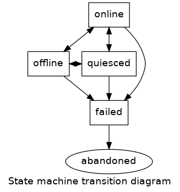

While the duties of the operator and GD2 are largely disjoint, there is some
level of coordination required between them. The operator is responsible for
adding and removing resources (nodes) from the GD2-managed cluster, and GD2 is
responsible for managing the free capacity and volumes within that cluster.

The main area for coordination is when removing nodes from the cluster and when
performing maintenance (that may result in downtime of a node).

Concretely:

- When removing a node from the cluster, GD2 should have the opportunity to
  remove data from that node prior to its deletion. While not strictly
  necessary, this allows proactive migration of data to maintain appropriate
  data redundancy.
- When a node may be offline for maintenance, it is necessary to notify GD2
  such that it does not decide the node has permanently failed. Such permanent
  failure designation would lead to needlessly rebuilding data to other
  locations in the cluster.

To facilitate this coordination, the following state machine is proposed. Note
that the diagram is just an approximation to keep the diagram simple, while
also providing a useful overview of the states and transitions.

The above state machine would apply independently to each node of the Gluster
cluster (i.e., each node has its own *current state*). The high-level meaning
of each state is:

- **online** - The node is operating normally and is available.
- **offline** - The node is currently unreachable by its peers in the cluster,
  and the bricks are considered offline. Nodes that spend too long in this
  state may be declared **failed**.
- **quiesced** - The node may be either up or down. It should not be
  automatically declared **failed**, nor should it be used for any provisioning
  or migration. This state is typically used when a node is undergoing
  maintenance.
- **failed** - This state indicates the node has been marked for removal from
  the cluster. The node may be up or down. Once a node is in this state, the
  only valid transition is into the **abandoned** state. While in this state,
  GD2 should rebuild any bricks onto other nodes in the cluster. Once this node
  no longer holds bricks for any volumes, it is transitioned to **abandoned**.
- **abandoned** - This state indicates the node has been cleared of all bricks.
  This is a terminal state for the node. The operator will remove from the
  cluster and destroy any node that enters the abandoned state.

# Removing a node

In order to remove a Gluster node from the cluster, there are a number of steps
involved, including:

- preventing new bricks from being allocated on the node,
- moving all existing bricks on the node to other nodes in the cluster,
- removing the node from the set of peers, and
- deleting the Gluster pod.

In keeping with the split of responsibilities between GD2 and the operator,
some of these tasks should be carried out by each of the components. The state
machine permits the proper hand-offs between components.  The states involved
in the removal of a node are the **failed** and **abandoned** states. Either
the operator or GD2 could trigger the initial switch into the **failed** state
to signal the desired removal of the node.

Once in the **failed** state, GD2 should not allocate any additional bricks on
the node, and it should actively work to move the bricks to elsewhere in the
cluster. The node remains in this state as long as bricks exist on the node.
This state does not imply whether the node is up or down. If the node is still
functional, GD2 may take advantage of that to speed migration. Additionally,
the node may still be used to service user I/O (assuming it is available).

After GD2 has finished moving all bricks to other nodes in the cluster, it
moves the state of the node to **abandoned**. Once the node reaches this state,
it will not be used for new allocations, nor does it hold any user data. Once
the operator sees the node has reached this state, the operator knows it is
safe to delete the node. The operator removes the node from the TSP, followed
by deleting the Deployment/pod for the node and freeing the storage that backed
the node.

# Node maintenance

It is necessary to notify the operator and GD2 when troubleshooting or
performing maintenance either on the Gluster cluster, or on infrastructure,
such that it may affect the availability of a Gluster node. The reason for
notification is to prevent the system (operator + GD2) from taking corrective
action if they detect the node is down and to prevent them from making other
changes to the node that may interfere with the ongoing maintenance.

Maintenance is signaled by moving the node into the **quiesced** state. A node
may enter this state from either **online** or **offline** (depending on
whether the node is currently up or down). The transition would be requested
via the operator. Once a node has entered the **quiesced** state, GD2 would not
trigger any migrations nor allocations on this node. It also would not mark a
node as **failed** if it is down for an extended period while in this state.

Once maintenance is completed, the operator can take the node out of
"maintenance" by triggering the transition to either the **online** or
**offline** state, depending on whether GD2 considers the node up or down.
(again, this is slightly simplified for explanation)

# State machine implementation

In the above description, some simplifications were made. For example, the
quiesced state has inconsistencies: When the operator triggers the exit from
the quiesced state, it cannot directly set the new state because online/offline
is a distiction that can only be made by GD2.

While it is possible to resolve these issues by adding additional states and
transitions (e.g., quiescedDown and quiescedUp), another approach is to
represent the state machine as a set of boolean conditions that can be changed
by either the operator or GD2:

- **isUp** - (GD2) - True if the node is up according to GD2
- **hasData** - (GD2) - True if the node contains 1 or more bricks
- **shouldQuiesce** - (operator) - True if the node should be quiesced
- **shouldDestroy** - (GD2/operator) - True if the node should be destroyed

By toggling the appropriate conditions, above, it is possible to implement the
state machine:

Condition     | online | offline | quiesced | failed | abandoned
--------------|:------:|:-------:|:--------:|:------:|:--------:
isUp          | 1      | 0       | x        | x      | x
hasData       | x      | x       | x        | 1      | 0
shouldQuiesce | 0      | 0       | 1        | x      | x
shouldDestroy | 0      | 0       | 0        | 1      | 1

Note:

- All 16 combinations are represented in the table, above
- shouldDestroy should never transition from 1 to 0. This enforces the one-way
  and terminal states of failed and abandoned.
